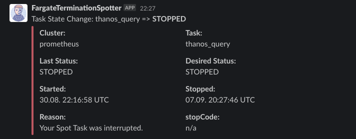

# FargateTermiationSpotter

This AWS Lambda function will notify a slack channel upon Spot-Instance terminations

## Requirements

No requirements.

## Providers

| Name                                                         | Version |
| ------------------------------------------------------------ | ------- |
|  [archive](#provider_archive) | n/a     |
|  [aws](#provider_aws)             | n/a     |
|  [null](#provider_null)          | n/a     |

## Modules

No modules.

## Resources

| Name                                                                                                                                                        | Type        |
| ----------------------------------------------------------------------------------------------------------------------------------------------------------- | ----------- |
| [aws_cloudwatch_event_rule.termination](https://registry.terraform.io/providers/hashicorp/aws/latest/docs/resources/cloudwatch_event_rule)                  | resource    |
| [aws_cloudwatch_event_target.lamdba](https://registry.terraform.io/providers/hashicorp/aws/latest/docs/resources/cloudwatch_event_target)                   | resource    |
| [aws_cloudwatch_log_group.spotter](https://registry.terraform.io/providers/hashicorp/aws/latest/docs/resources/cloudwatch_log_group)                        | resource    |
| [aws_iam_policy.terminationspotter](https://registry.terraform.io/providers/hashicorp/aws/latest/docs/resources/iam_policy)                                 | resource    |
| [aws_iam_role.spotter](https://registry.terraform.io/providers/hashicorp/aws/latest/docs/resources/iam_role)                                                | resource    |
| [aws_iam_role_policy_attachment.terminationspotter](https://registry.terraform.io/providers/hashicorp/aws/latest/docs/resources/iam_role_policy_attachment) | resource    |
| [aws_lambda_function.spotter](https://registry.terraform.io/providers/hashicorp/aws/latest/docs/resources/lambda_function)                                  | resource    |
| [aws_lambda_permission.eventbridge_to_lambda](https://registry.terraform.io/providers/hashicorp/aws/latest/docs/resources/lambda_permission)                | resource    |
| [null_resource.lambda_build](https://registry.terraform.io/providers/hashicorp/null/latest/docs/resources/resource)                                         | resource    |
| [archive_file.lambda_function](https://registry.terraform.io/providers/hashicorp/archive/latest/docs/data-sources/file)                                     | data source |
| [aws_iam_policy_document.terminationspotter](https://registry.terraform.io/providers/hashicorp/aws/latest/docs/data-sources/iam_policy_document)            | data source |

## Inputs

| Name                                                                                       | Description                                                                | Type     | Default  | Required |
| ------------------------------------------------------------------------------------------ | -------------------------------------------------------------------------- | -------- | -------- | :------: |
|  [api_token](#input_api_token)                               | the slack API token                                                        | `string` | n/a      |   yes    |
|  [filter_deploys](#input_filter_deploys)                | Do not send a notification for scaling activities related to deploys       | `string` | `"true"` |    no    |
|  [filter_intermediate](#input_filter_intermediate) | Do not send notifications for pending, stopping, activating... containers. | `string` | n/a      |   yes    |
|  [slack_channels](#input_slack_channels)                | The channel to send alerts to                                              | `string` | n/a      |   yes    |

## Outputs

No outputs.
